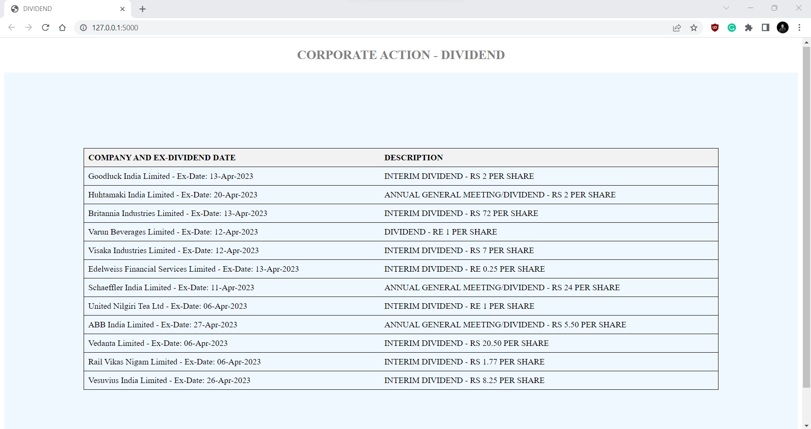

# Upcoming-Dividend-Tracker
This project monitors the announcement of the upcoming dividend by the NSE (National Stock Exchange of India Limited).

Source of the data : https://www.nseindia.com/companies-listing/corporate-filings-actions

<hr/>



This project is developed using Python with Flask as the backend which shows the upcoming dividend along with ex-date and amount that is offically announced by the NSE.


# Running
Install necessary python libraries as per _requirements.txt_ file
```
pip install -r requirements.txt 
python app.py
```
Disclaimer: The data used in this project comes from [NSE](https://www.nseindia.com/). The use of this data is for educational/research purposes only and is not intended for commercial or personal gain. I acknowledges and respects the intellectual property rights of NSE and their respective owners. I do not claim ownership of the data and assumes no responsibility or liability for any errors, inaccuracies, or misinterpretations that may arise from the use of this data.

Copyright Disclaimer under the Copyright Act of 1957 : The content in this project is governed by the Copyright Act of 1957. It is used for educational and informational purposes. If you are a copyright holder and believe your rights are infringed, please contact us for resolution. I respect the rights of copyright owners and comply with the Copyright Act of 1957. I acknowledge applicable exceptions and limitations under the Copyright Act of 1957, including fair dealing and educational use. Users are urged to respect intellectual property rights, and any unauthorized use may require permission from the copyright owner.
